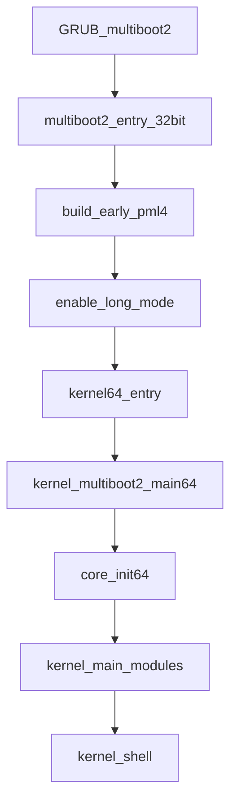

## Goal
Move the **kernel** to **x86_64 long mode** while **keeping GRUB + Multiboot2 ISO/USB** as the primary boot path. Preserve Curls’ “Sacred Core → K-ABI policy modules” shape and keep the system usable early via **serial-first debug** + framebuffer console.

## Current architecture snapshot (what we must preserve)
- **Boot entry**: GRUB loads `[boot/multiboot2_entry.asm](boot/multiboot2_entry.asm)` → `kernel_multiboot2_main()` in `[kernel/core/boot_multiboot2.c](kernel/core/boot_multiboot2.c)` → `kernel_main()` in `[kernel/core/kernel.c](kernel/core/kernel.c)`.
- **Sacred Core ordering**: `kernel_main()` calls `core_init()` first (`[kernel/core/core_init.c](kernel/core/core_init.c)`), which sets up GDT/IDT/IRQs, paging, ktrace, CPU local/TSS, FS, KABI bridge, tasking, syscalls, then enables interrupts.
- **Console design**: all logging funnels through `kprint()` (`[kernel/modules/drivers/screen.c](kernel/modules/drivers/screen.c)`), which mirrors output to UART and either VGA or framebuffer text.
- **K-ABI vision**: modules are initialized after `core_init()` in `kernel_main()` (screen, keyboard, uart, sched_rr, initrd, USB stack, shell, sysmon), and KABI acts as the stable boundary.

## Key design decisions for x64 (chosen to keep risk low)
- **Boot**: stay with **GRUB `multiboot2`**. GRUB enters in **32-bit protected mode**, so we add a **32→64 trampoline** in `multiboot2_entry` that enables long mode then calls a 64-bit C entry.
- **Syscalls**: start with **`int 0x80`** in long mode (DPL3 gate in IDT), keeping the existing syscall dispatch shape; optionally migrate later to `syscall/sysret`.
- **Userland**: treat as a separate phase. For the first working x64 kernel, prioritize kernel bring-up + drivers; then port userland to **ELF64 + U-ABI v2** (recommended) or add compat later.
- **BIOS floppy path**: explicitly **out of scope** (GRUB-only) per your choice.

## Migration map (what must change vs what can stay)
### Must change (hard 32-bit assumptions)
- Paging model: current 2-level `page_directory_t` + 20-bit frames (`[kernel/cpu/paging.h](kernel/cpu/paging.h)`, `[kernel/cpu/paging.c](kernel/cpu/paging.c)`) → x86_64 **4-level PML4/PDPT/PD/PT** with 64-bit entries.
- Interrupt machinery: 32-bit IDT gates (`[kernel/cpu/idt.h](kernel/cpu/idt.h)`), ISR stubs using `pusha` (`[kernel/cpu/interrupt.asm](kernel/cpu/interrupt.asm)`) → 64-bit gates and stubs, `iretq` frames, optional IST.
- GDT/TSS: 32-bit TSS (`[kernel/cpu/gdt.h](kernel/cpu/gdt.h)`) → 64-bit TSS (RSP0 + IST). `set_kernel_stack()` must write `tss.rsp0`.
- Address types: pervasive `uint32_t` used for pointers/addresses in tasking, exec, ELF loader, KABI structs.

### Can stay conceptually (with widened types)
- PMM bitmap/refcounts approach, PHYSMAP concept, heap allocator algorithms, tasking model (ready queue + fork/COW), KABI layering, driver init order.

## Proposed end-state boot/data flow (GRUB → long mode → kernel)

## Concrete implementation plan (incremental, bootable at each milestone)

### Phase 0: Repo structure + dual-arch scaffolding (no behavioral change yet)
- Create an `arch/` split to isolate architecture-sensitive code.
  - Example layout:
    - `[arch/x86_64/boot/](arch/x86_64/boot/)` (new long-mode trampoline and 64-bit entry)
    - `[arch/x86_64/mmu/](arch/x86_64/mmu/)` (PML4 paging + map/unmap)
    - `[arch/x86_64/interrupts/](arch/x86_64/interrupts/)` (IDT + ISR stubs)
    - `[arch/x86_64/cpu/](arch/x86_64/cpu/)` (GDT/TSS, MSRs)
  - Keep existing 32-bit code in place until x64 path boots.
- Introduce shared types:
  - `virt_addr_t`, `phys_addr_t`, `size_t` usage in core headers.

### Phase 1: 64-bit build pipeline (still Multiboot2)
- Toolchain:
  - Switch kernel build to a cross toolchain (recommended) `x86_64-elf-gcc`/`x86_64-elf-ld`.
  - Keep `-ffreestanding -fno-pie -no-pie -fno-pic`.
- Linker:
  - Add a 64-bit linker script `[linker64.ld](linker64.ld)`.
  - Keep `.multiboot2` within the first 32KiB of the file.
  - Choose a simple initial mapping strategy:
    - **Identity-map low memory** for early bring-up.
    - Optionally add a higher-half mapping later.
- Makefile:
  - Update `[Makefile](Makefile)` ISO rule to build/copy the 64-bit kernel ELF (e.g. `build/kernel64.elf` → `build/iso/boot/kernel.elf`).
  - Keep GRUB config using `multiboot2 /boot/kernel.elf` and the existing `all_video/gfxterm/gfxpayload=keep` settings.

### Phase 2: 32→64 trampoline in `multiboot2_entry` (first long-mode boot)
- Replace the current “just set ESP + call C” in `[boot/multiboot2_entry.asm](boot/multiboot2_entry.asm)` with:
  - 32-bit entry label (Multiboot2 contract): save `eax`/`ebx`.
  - Build minimal early page tables (PML4 + PDPT + PD) to map:
    - the low physical region containing kernel + Multiboot info,
    - a kernel stack,
    - optionally VGA memory `0xb8000`.
  - Enable long mode:
    - `cr4.PAE=1`, set `IA32_EFER.LME=1`, load `cr3` with PML4 phys, set `cr0.PG=1`, far jump to 64-bit CS.
  - In 64-bit label: set `rsp`, align stack, call `kernel_multiboot2_main64(magic, mbi)`.
- Add `[kernel/core/boot_multiboot2_64.c](kernel/core/boot_multiboot2_64.c)`:
  - Parse Multiboot2 tags using 64-bit-safe pointer arithmetic (`uintptr_t`).
  - Populate `boot_fb_info` (already 64-bit address in `[kernel/core/boot_info.h](kernel/core/boot_info.h)`).
  - Call `kernel_main()` (now 64-bit compiled).

### Phase 3: Paging64 foundation that preserves your memory-model “feel”
Replace 32-bit paging with an x64 MMU layer while preserving your concepts:
- New API surface (example):
  - `mmu_map_page(as, virt, phys, flags)`
  - `mmu_unmap_page(as, virt)`
  - `mmu_clone_user(as_src)` with COW
  - `mmu_promote_user_range(as, start, size)`
- Implement 4-level tables with 512 entries per level.
- Recreate these existing concepts in x64:
  - **Kernel heap region** (update `[libc/kheap.h](libc/kheap.h)` constants to 64-bit canonical addresses).
  - **PHYSMAP** linear map (keep the idea of `PHYSMAP_BASE + phys`).
  - **Framebuffer mapping** (drop the current “>4GiB disable” limitation from `[kernel/cpu/paging.c](kernel/cpu/paging.c)`—x64 can map it).
- PMM evolution:
  - Replace fixed `MAX_FRAMES 32768` with a PMM sized from the Multiboot2 memory map (new parsing in boot path).
  - Keep refcount + bitmap semantics (needed for COW).

### Phase 4: GDT/TSS64 + per-task kernel stacks (preserve tasking model)
- Port `[kernel/cpu/gdt.c](kernel/cpu/gdt.c)` / `[kernel/cpu/gdt.h](kernel/cpu/gdt.h)` to x64:
  - 64-bit code/data segments for ring0 and ring3.
  - 64-bit TSS descriptor + TSS structure (RSP0 + IST).
  - Update `set_kernel_stack()` to set `tss.rsp0`.
- Ensure task switch updates kernel stack top exactly like today.

### Phase 5: IDT64 + ISR stubs + scheduler handoff
- Port `[kernel/cpu/idt.c](kernel/cpu/idt.c)`, `[kernel/cpu/idt.h](kernel/cpu/idt.h)` to 64-bit gates (offset_low/mid/high + IST).
- Rewrite `[kernel/cpu/interrupt.asm](kernel/cpu/interrupt.asm)` for x86_64:
  - No `pusha`; push/pop GPRs explicitly incl. `r8..r15`.
  - Build a `registers64_t` frame and call C `isr_handler()`.
  - Return with `iretq`.
- Preserve your scheduling trick:
  - Today, the common stub consults `task_switch_esp` to jump stacks mid-IRQ.
  - Recreate this in 64-bit (now `task_switch_rsp`) so timer IRQ can switch tasks without returning through C.

### Phase 6: Syscalls in x64 (keep shape; don’t break semantics)
- Keep the same dispatcher entry point concept in `[kernel/core/syscall_dispatch.c](kernel/core/syscall_dispatch.c)`.
- Implement **`int 0x80` gate in IDT** with DPL3 in long mode.
  - Update syscall register convention to a documented x64 U-ABI:
    - Minimal-change path: `rax=sysno`, `rbx/rcx/rdx` args (mirrors current style).
    - Recommended long-term: `rax=sysno`, `rdi/rsi/rdx/r10/r8/r9` args (Linux-like).
- Update the `registers_t` structure to 64-bit fields and adjust syscall handler accordingly.

### Phase 7: Userland + ELF64 + U-ABI v2 (recommended)
To keep “functional stuff” (shell, programs) without carrying a complicated compat layer:
- Add an ELF64 loader alongside current ELF32 (`[kernel/fs/elf/](kernel/fs/elf/)`):
  - Accept `EM_X86_64`, 64-bit program headers, 64-bit vaddrs.
  - Map segments with the new mmu layer.
- Create U-ABI v2 headers (e.g. `[include/uabi/uabi_v2.h](include/uabi/uabi_v2.h)`) with widened pointer/size types.
- Rebuild user programs as x86_64:
  - New `user/lib/user64.ld`, update Makefile rules for userland.
  - New syscall stubs `user/lib/uabi_syscalls64.s`.

### Phase 8: Keep the kernel vision intact (K-ABI on x64)
- Decide K-ABI strategy:
  - Either conditionalize types in `[include/kabi/kabi_v1.h](include/kabi/kabi_v1.h)` for x64 (fastest), or declare K-ABI v2 explicitly.
- Update KABI structs that contain addresses/stacks (e.g. task info) to 64-bit types on x64.
- Ensure module init order in `[kernel/core/kernel.c](kernel/core/kernel.c)` stays the same; only the underlying arch layers change.

## Testing strategy (bootable milestones)
- **Milestone A (boot)**: GRUB loads kernel, trampoline enters long mode, prints via serial.
- **Milestone B (paging)**: heap + PHYSMAP + basic alloc works; ktrace initializes; page fault handler works.
- **Milestone C (console)**: framebuffer text works on UEFI GOP machines; VGA fallback works in QEMU.
- **Milestone D (tasking)**: scheduler tick switches tasks; fork/exec stable.
- **Milestone E (userspace)**: ELF64 shell + basic programs run.

## High-risk areas (plan mitigations)
- **Paging/COW**: rewrite in 4-level tables but preserve refcount + COW semantics; validate with targeted unit tests already present in `[kernel/core/tests/](kernel/core/tests/)`.
- **Interrupt frames**: strict alignment between ASM push order and `registers64_t` is critical; lock down with a single shared layout definition.
- **ABI churn**: keep syscall semantics stable; introduce U-ABI v2 cleanly and keep U-ABI v1 as i386-only.

